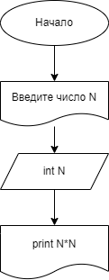
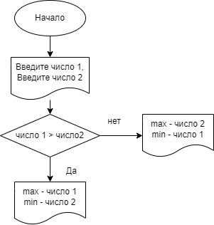

## Это задачи от Сергея.
1. homework01
#### Вывести квадрат числа

[Код](homework01/Program.cs)

2. homework02
#### Даны два числа. Показать большее и меньшее число.

[Код](homework02/Program.cs)

2. homework31
#### Задать массив из 8 элементов и вывести их на экран 

[Код](homework_31/Program.cs)

3. Homework_33
#### Задать массив из 12 элементов, заполненных числами из [-9,9]. 
#### Найти сумму положительных/отрицательных элементов массива

[Код](homework_33/Program.cs)

4. Homework_37
#### В одномерном массиве из 123 чисел найти количество элементов из отрезка [10, 99]

[Код](homework_37/Program.cs)

5. tetris_00
#### Создать тетрис

[Код](tetris_00/Program.cs)